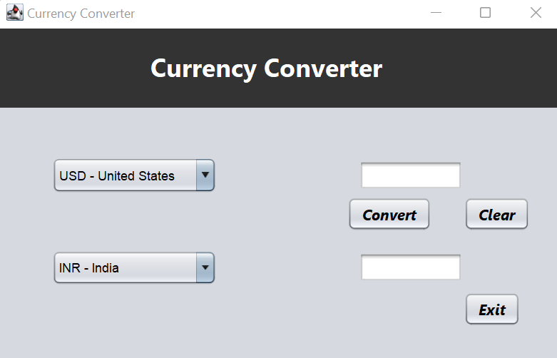

# Currency-Converter-using-Java
This is a simple project implemented using Java and Java Swings to convert currencies in other countries 
equivalents. Basic currency conversion operations were implemented for 4 currencies ie USD, INR, EURO and CAD.  

### Output

